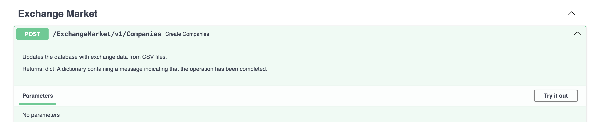
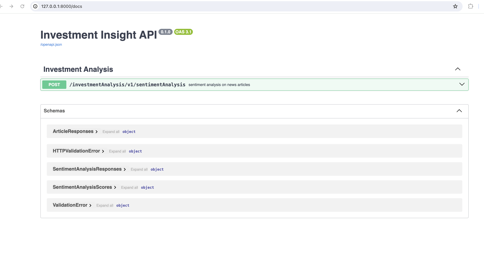

# Investment Buddy Backend Project

This backend is built using the FastAPI framework.
For detailed documentation on FastAPI, visit: [FastAPI Documentation](https://fastapi.tiangolo.com/)

## Option 1: Setting Up Environment (venv)

1. Create the virtual environment file:

`python3.8 -m venv env`

2. Activate the virtual environment:

`source env/bin/activate`

3. Verify that the new environment is working:

`pip freeze`

3. Install packages:

`pip install -r requirements.txt`

## Option 2: Setting Up Environment (Conda)

1. Create the Conda environment from the provided `environment.yml` file:

`conda env create -f environment.yml`

2. Activate the newly created environment:

`conda activate myenv`

3. Verify that the new environment was installed correctly:

`conda env list`

For more information on managing Conda environments, refer to the [Conda User Guide](https://conda.io/projects/conda/en/latest/user-guide/tasks/manage-environments.html).

## Setting up MySQL Database

To set up the MySQL database, follow these steps:

1. **Install MySQL and download MySQL Workbench:** Ensure that MySQL is installed on your system and download MySQL Workbench for easy database management.

2. **Create Schema:** Create a schema called `InvestmentInsightApplication` in your MySQL database.

3. **Add Table:** Add a table using the following query:

```sql
    CREATE TABLE companies (
    id VARCHAR(255) NOT NULL,
    name VARCHAR(255) DEFAULT NULL,
    ticker VARCHAR(20) DEFAULT NULL,
    cik VARCHAR(20) DEFAULT NULL,
    cusip VARCHAR(20) DEFAULT NULL,
    exchange VARCHAR(50) DEFAULT NULL,
    is_delisted TINYINT(1) DEFAULT NULL,
    category VARCHAR(50) DEFAULT NULL,
    sector VARCHAR(50) DEFAULT NULL,
    industry VARCHAR(50) DEFAULT NULL,
    sic VARCHAR(20) DEFAULT NULL,
    sic_sector VARCHAR(50) DEFAULT NULL,
    sic_industry VARCHAR(50) DEFAULT NULL,
    fama_sector VARCHAR(50) DEFAULT NULL,
    fama_industry VARCHAR(50) DEFAULT NULL,
    currency VARCHAR(10) DEFAULT NULL,
    location VARCHAR(255) DEFAULT NULL,
    PRIMARY KEY (id)
    );
```

4. **Add Database Password in .env:** Store your database password securely in a .env file:

`DB_PASSWORD=your_database_password`

5. **Start Server and Run Endpoint**: Start your server and run the endpoint that updates the database with exchange data from CSV files



## Running the FastAPI Server Locally

To start the FastAPI local server, use the following command (run from the root directory of your project):

`uvicorn main:app --reload`

Visit [http://127.0.0.1:8000/docs](http://127.0.0.1:8000/docs) in your browser to access the Swagger API documentation.



### Adding API Key in `.env`

If your application requires an API key from [News API](https://newsapi.org/), make sure to add it in the `.env` file. Replace placeholder with your api key

` API_KEY=placeholder`

## Start Testing!

You're all set up! Happy testing!.
